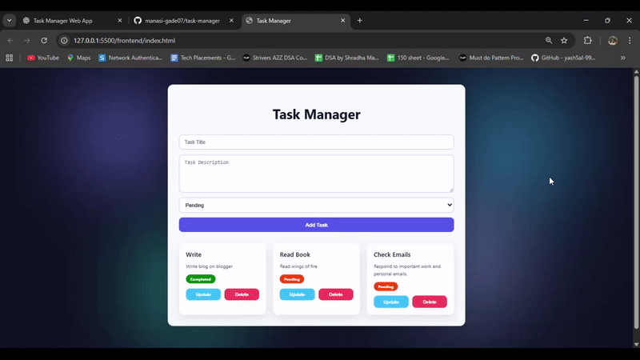

# Task Manager Web App

A full-stack **Task Management Web Application** built with **Node.js, Express, MongoDB, and vanilla JavaScript**.  
Easily **add, update, and delete tasks**, set task status (**Pending, In Progress, Completed**), and store tasks persistently in **MongoDB**.  
Features a **clean, responsive, and modern UI**.



---

## Features

- Add, update, and delete tasks  
- Set task status: **Pending**, **In Progress**, **Completed**  
- Persistent storage in **MongoDB**  
- Responsive, modern UI  

---


## Quick Start

### 1. Clone the Repository

```bash
git clone https://github.com/manasi-gade07/task-manager.git
cd task-manager
````

### 2. Backend Setup

```bash
cd backend
npm install
```

Create a `.env` file in the `backend/` folder:

```env
MONGO_URI=your_mongodb_connection_string
PORT=5000
```

Start the backend server:

```bash
npm run dev
```

The backend runs at: `http://localhost:5000`

### 3. Frontend Setup

Open `frontend/index.html` in your browser.
Ensure the backend API URL is correct in `frontend/script.js`:

```javascript
const API_URL = 'http://localhost:5000/api/tasks';
```

---

## How to Verify Tasks in MongoDB

You can check that tasks are stored correctly using **MongoDB Compass** or the **Mongo shell**:

```bash
mongo
use your_database_name
db.tasks.find().pretty()
```

You will see all stored tasks with **title, description, status, and timestamps**.

---

## Deployment

* **Backend:** Deploy to [Render](https://render.com/) or a similar service
* **Frontend:** Deploy to [Netlify](https://www.netlify.com/) or [Vercel](https://vercel.com/)
* Update `API_URL` in `frontend/script.js` to point to the deployed backend

---

## Tech Stack

* **Frontend:** HTML, CSS, JavaScript
* **Backend:** Node.js, Express
* **Database:** MongoDB
* **Tools:** MongoDB Compass, npm

---

## License

MIT License © [Manasi Gade](https://github.com/manasi-gade07)


